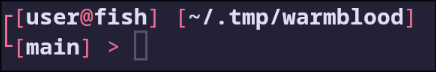
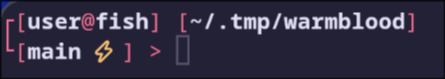
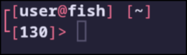
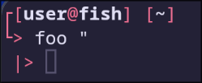

# warmblood

My personal zsh prompt theme, using the [darkblood theme](https://github.com/ohmyzsh/ohmyzsh/blob/master/themes/darkblood.zsh-theme) from ohmyzsh as the base theme and altering a few small things

*Note* I am personally using a kitty terminal with the rose-pine-moon theme. Actual colors may vary in your own terminal based on your current color config. If you want to have similar colors to what I have, please reference the rose-pine-moon.conf file for color hex values.
